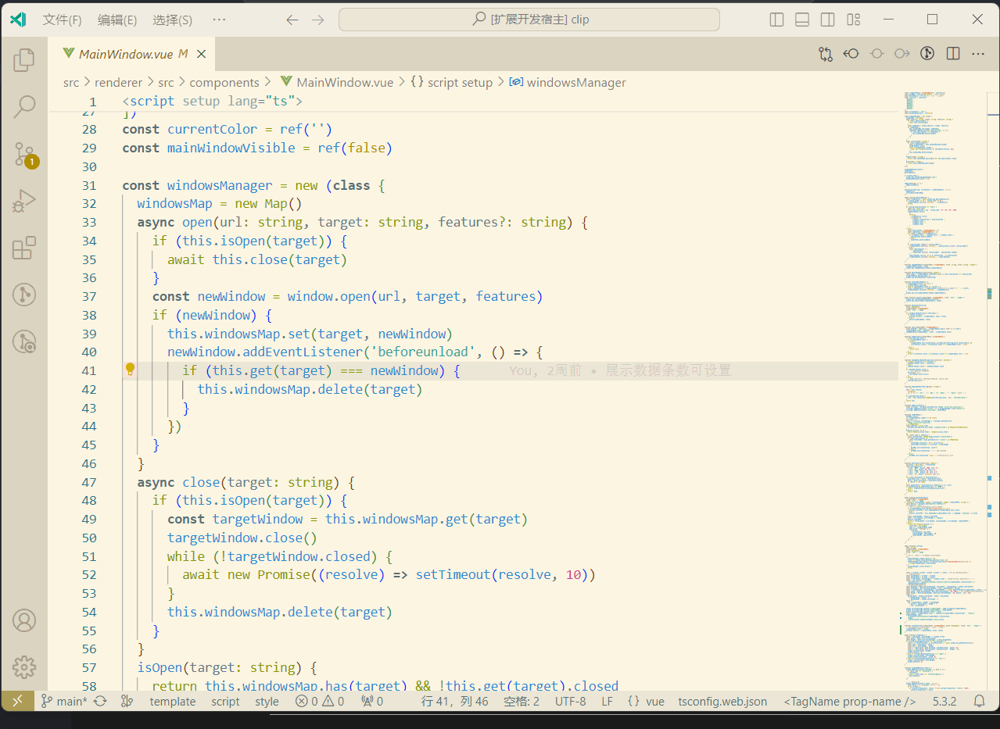

# vue-jump README

## Features

Quickly jump to template, script and style tag in vue file

## Following extension guidelines

shortcuts:

- Jump to template tag (`cmd+alt+1` on macOS or `ctrl+alt+1` on Windows and Linux)
- Jump to script tag (`cmd+alt+2` on macOS or `ctrl+alt+2` on Windows and Linux)
- Jump to style tag (`cmd+alt+3` on macOS or `ctrl+alt+3` on Windows and Linux)

**Enjoy!**
